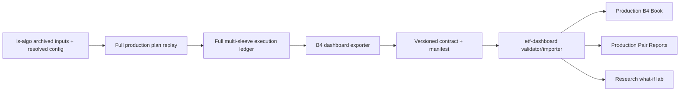

# Bucket 4 Dashboard to `ls-algo` Production Parity Plan

**Date:** 2026-07-18
**Status:** Implemented in code on 2026-07-18; cross-repository merge order and live shadow/Flex observation remain operational rollout gates
**Dashboard baseline:** `etf-dashboard` main at `32c861967e066eb8f42d37cefb2378c0b7d5f699`
**Production reference audited:** local `ls-algo` main at `6812fb8f0dfc04544c3bce38523b99c0db5b5b9a`, including the working-tree production changes present on 2026-07-18

## Executive decision

`ls-algo` must own the authoritative historical plan replay, execution state machine, and accounting ledger. `etf-dashboard` must consume a versioned static export from that engine and limit itself to schema validation, presentation, and clearly labeled research transformations.

Do not continue porting production formulas into `etf-dashboard`. The dashboard currently imports the `ls-algo` sizing API but independently implements eligibility, ratchet state, pair execution, costs, and portfolio aggregation. That can match a sizing snapshot while still producing a materially different book.

The production view is complete only when the B4 book and pair reports are lossless projections of one full `ls-algo` production replay. The existing client-side custom-book lab can remain, but it must be labeled **Research / what-if** and must never overwrite or be described as the production path.

### Implemented cutover

- `ls-algo/scripts/export_b4_dashboard.py` can run the full production replay and exports `bucket4_production_replay.v1` with canonical hashes, source provenance, resolved policy, audits, exact B4 book ledger, and per-pair ledgers.
- Pair PnL is reconciled to the source B4 sleeve; shared-financing residual is exported as an explicit pro-rata ledger allocation and must reconcile within $0.01.
- `etf-dashboard/scripts/import_bucket4_production.py` validates authority, source cleanliness, freshness, hashes, and reconciliation before writing `bucket4_backtest.v4`.
- `scripts/build_bucket4_backtest.py` defaults to the strict production importer. The former local engine requires `--mode research-legacy` and is never an automatic fallback.
- Production client reblending is disabled. B4 Book and Pair Reports scale exported ledger PnL only, show source provenance, and keep editable scenarios on separate research routes.
- Nightly generation runs the full `ls-algo` replay, exports the contract, then imports it fail-closed.

## What “completely reflective” means

For a fixed run manifest, the two repositories must agree on all of the following:

1. **Inputs:** same point-in-time screened archives, price panel, corporate actions, price patches, delist table, borrow history, config, calendar, and starting state.
2. **Plan formation:** same B4 membership, purgatory rows, model and executable legs, opt2 weights, crash caps, post-cap smoothing, ratchet fields, and sleeve budget.
3. **Execution:** same signal lag, operator clock, cadence dates, `h`, membership deferrals, Phase-2b bands, ratchet cover guard, empty-plan hold, delist/hard exits, turnover allocation, and block reasons.
4. **Accounting:** same shares/notionals, close-to-close PnL, borrow, commissions, slippage, short-proceeds credit, margin debit, shared-underlying netting, cash, and daily NAV.
5. **Output:** dashboard production book, pair paths, rebalance marks, costs, PnL, and summary statistics are derived from the exported ledger without resimulation.
6. **Provenance:** every build identifies the exact `ls-algo` commit or content hash, dirty-state hash if applicable, policy hash, input hashes, state seed, run dates, and known deviations.

“Complete” does not mean predicting actual broker fills. Whole-share rounding, intraday fills, locate rejects, and broker corrections can only be called production-identical after they are sourced from execution/Flex records. Until then, the dashboard must say **production-policy replay** and list those limitations in the artifact.

## Root cause and immediate NBIZ correction

NBIZ declared a 1-for-10 reverse split for 2026-06-03, but its market close switched to the post-split basis on 2026-06-01. Because NBIS rose about 14% on that session, the observed NBIZ close jump was about 6.85x rather than a clean 10x. The old exact-ratio check did not recognize the basis boundary and fed a false +585% ETF move into the short-pair ledger.

The dashboard repair now:

- confirms the declared multiple from the issuer NAV or shares transition;
- locates a nearby same-direction partial close jump in log space;
- snaps the adjustment boundary to that close-basis switch;
- still refuses to scale a continuous close history with no price-basis boundary; and
- applies the dashboard-native split repair before the optional `ls-algo` price-panel repair.

For NBIZ this maps the 2026-05-29 close from 1.255 to 12.55 and leaves 2026-06-01 at 8.60. The rebuilt pair path changes from final equity -3.477475 and max drawdown -4.9961 to final equity 1.755948 and max drawdown -0.2057.

This fixes the immediate data failure. It does not make the dashboard execution engine production-equivalent; the remaining sections define that migration.

## Current architecture and verified gaps

### Current dashboard path

```text
latest dashboard screener
  -> dashboard-local B4 gates
  -> weekly calls to ls-algo sizing-only API
  -> dashboard-local smoothing/ratchet compatibility paths
  -> independent unit-capital pair simulations
  -> forward-filled weekly weights x independent pair returns
  -> static B4 JSON + browser custom reblend
```

The imported `scripts/bucket4_backtest_api.py` explicitly exports sizing only and leaves the ratchet to the dashboard. Each dashboard pair simulation resets gross to its own current equity, then the aggregate multiplies those independent returns by a weekly weight matrix.

### Current production-policy replay

```text
archived point-in-time screeners
  -> full generate_trade_plan replay with isolated persisted state
  -> normalized daily plan timeline, model legs, executable legs, and policies
  -> next-close multi-sleeve share ledger
  -> operator membership + TR/VCR B4 cadence
  -> purgatory reduce-only + Phase-2b bands + ratchet guards
  -> turnover/ADV allocation + hedge controls
  -> shared-underlying financing/netting + full daily accounting
  -> book, sleeve, pair, trade, and pending-target ledgers
```

The production reference is `run_prod_replay_backtest` and `simulate_book_from_plan_timeline` in `ls-algo/scripts/production_actual_backtest.py`, with live semantics supplied by `generate_trade_plan.py`, `rebalance_strategy.py`, `phase2b_resize.py`, `execute_trade_plan.py`, and `pair_hedge_ratio_safety.py`.

### Gap matrix

| Area | Dashboard today | `ls-algo` production path | Required resolution |
|---|---|---|---|
| Policy source | Dated copy in `config/bucket4_backtest_policy.yml` | Live `config/strategy_config.yml` plus code defaults | Export resolved policy and hash from `ls-algo`; no production copy in dashboard |
| Run inputs | Latest screener reused through history | Archived point-in-time screened timeline | Replay the archived timeline in `ls-algo` and export its manifest |
| Eligibility | Local edge/vol/borrow/exclusion gates; purgatory excluded | Full screener/GTP gates, entry-vs-keep bands, low-N inclusion, structural/executable distinction | Use plan membership and reason fields from the production timeline |
| Sizing | Weekly sizing API | Full GTP opt2 -> crash -> smooth -> ratchet with isolated state | Export final plan targets and state; remove dashboard sizing from production mode |
| Config coverage | Snapshot omits live `target_gross_usd`, low-N inclusion, shares-outstanding cap, state paths, execution cover policy, trend weighting, and other fields | All resolved from live config | Contract test must fail on unresolved or silently defaulted production fields |
| Ratchet | Dashboard `SimRatchetState`, unit-normalized and capped | USD floors, continuous trim, persisted plan state, ledger cover pin/trim cap | Use exported plan and execution fields; do not recompute in dashboard |
| Membership | Pair appears when current local gate/weight is positive | Operator-clock establish/drop, membership state, empty-plan hold | Export membership events and deferrals from the ledger |
| Purgatory | Excluded | Stays in plan; executable zero means hold/reduce-only, not flatten | Render held/trimmed purgatory positions and reasons |
| Cadence | Local TR/VCR dates and a share-of-gross skip | Production cadence state, operator checks, max-interval forcing | Export actual due/scheduled/executed decisions and `h` |
| Resize | Full pair retarget when local cadence fires | Phase-2b 12%/4%/$250 hysteresis and ratchet cover guard | Export target, band decision, and executed target per leg |
| Plan timing | Weekly weights forward-filled | Daily plan activation with one-session execution lag | Use the production session ledger |
| Turnover | No book-level allocator or ADV participation | `hedge_safe_v1`, target blending, gap stepping, priority budget, optional ADV cap | Export requested/allocated/deferred turnover and block reasons |
| Hedge safety | Pair-local hedge only | Production pair controls and stock-sleeve residual/ratio safety where applicable | Carry all ledger reason codes and any B4-relevant overrides |
| Corporate actions | Dashboard metrics plus split repairs | Flex splits, overrides, patches, referee data, delists | One resolved production price panel; dashboard split audit remains an upstream gate |
| Costs | Percent-of-notional fee and slippage inside each unit pair | 20 bp slippage, $0.0035/share commission, borrow history, short credit, margin, Actual/360 | Use exported daily cost components |
| Cross-sleeve effects | B4 isolated; pair returns treated as independent | Shared underlying notionals can net for financing and book exposure | Generate B4 views from the full multi-sleeve ledger, not an isolated rerun |
| Accounting | Unit pair equity reblended by weights | Dollar/share ledger with cash and equity-scaled targets | Export dollar ledger; derive display returns from B4 sleeve NAV |
| Delist/hard exit | No equivalent state machine | Same-session forced flatten and plan blocks | Export events and resulting fills/PnL |
| UI custom weights | Reblends precomputed unit returns and can look production-like | Not a production operation | Separate into Research mode with an explicit non-production badge |
| Tests | Helper assertions and sizing smoke test | Detailed production ledger tests | Add end-to-end golden parity and invariant suites |
| CI | B4 build is `continue-on-error` and checks out moving `main` | Production behavior can change without dashboard failure | Make parity generation/validation gating and record the exact source revision |

## Target architecture



### Ownership boundary

`ls-algo` owns:

- resolved production config and policy defaults;
- archived-input replay and state isolation;
- membership, sizing, cadence, execution, and accounting;
- price-panel resolution and corporate-action/delist handling;
- the authoritative B4 export and reconciliation diagnostics.

`etf-dashboard` owns:

- validating schema, hashes, freshness, and completeness;
- copying/compacting the authoritative export for static hosting;
- display calculations that are mathematically lossless, such as notional scaling of a normalized production series;
- UI labels, diagnostics, and separate research-only transformations.

### Export contract

Create a versioned `bucket4_production_replay.v1` export in `ls-algo`. It should contain:

#### `manifest.json`

- schema and exporter version;
- `ls-algo` commit SHA and content hash, including dirty patch hash when non-clean;
- resolved config hash and relevant resolved config payload;
- price-panel, screener-archive, borrow-history, corporate-action, price-patch, delist, and calendar hashes;
- start/end/run dates and timezone;
- starting capital, sleeve budgets, state seed type, and state file hashes;
- execution assumptions and explicit limitations;
- row counts, pair counts, first/last dates, and validation status;
- `authoritative: true` only after every required gate passes.

#### `book.json`

- daily B4 sleeve NAV and return;
- daily price, financing, borrow, commission, slippage, and total PnL;
- cash, gross, net, long, short, deployed/desired gross, and turnover;
- drawdown and summary statistics;
- reconciliation totals tying pair contributions to the B4 sleeve and the sleeve to the full book.

#### `pairs/{ETF}.json`

- daily ETF and underlying resolved prices;
- shares and signed notionals for both legs;
- model, executable, desired, allocated, and filled targets;
- `h`, beta, cadence due/executed, operator day, membership state, purgatory/execution policy, ratchet fields, band decision, and reason code;
- price PnL, borrow, financing, commission, slippage, total PnL, cumulative PnL, and contribution;
- entries, exits, trims, resizes, deferrals, hard exits, and delist events;
- pair-level reconciliation and statistics.

#### `audit/`

- normalized B4 plan history;
- B4 trade ledger;
- pending-target audit;
- cadence and membership decisions;
- price-integrity results;
- parity/reconciliation report.

The export should preserve full precision in its canonical ledger. Compact/rounded web fields may be derived only after reconciliation, and the manifest must state the rounding rules.

## Implementation workstreams

### P0 - Freeze the reference contract and golden window

1. Select one clean `ls-algo` revision after the current production changes are committed.
2. Record the exact config and all input hashes; a commit SHA alone is insufficient if the source tree is dirty.
3. Use 2026-02-27 through 2026-07-18 as the initial golden window because archived screeners begin on 2026-02-27 and the window covers membership/purgatory changes and the NBIZ split.
4. Preserve the current dashboard v3 artifacts as a legacy comparison fixture.
5. Generate the authoritative `ls-algo` production replay once with a fresh isolated state root and once with cached plans; require identical execution output when inputs are identical.

**Exit:** one immutable golden run with a complete manifest and reproducible hashes.

### P1 - Make price integrity a shared precondition

1. Keep the dashboard corporate-actions pipeline authoritative for its metrics feed and retain the new staggered-boundary detection.
2. Ensure the resolved `ls-algo` panel consumes the corrected NBIZ basis or carries an equivalent durable patch.
3. Run both the dashboard split-TR audit and the `ls-algo` price-integrity audit before export.
4. Fail production export on a held-name unconfirmed split-like jump, stale/truncated position mark, or non-reconciled price patch.
5. Include every applied price source and patch reason in the manifest/audit files.

**NBIZ acceptance fixture:** 2026-05-29 adjusted close 12.55; 2026-06-01 close 8.60; maximum absolute close return in the 2026-05-29 to 2026-06-04 window below 35%; no split-driven ledger cliff.

### P2 - Add the authoritative exporter in `ls-algo`

1. Add `scripts/b4_dashboard_contract.py` for schema construction and validation.
2. Add `scripts/export_b4_dashboard.py` as the stable CLI/API.
3. Refactor `run_prod_replay_backtest` to return or persist typed ledger tables without requiring notebook parsing.
4. Build the B4 sleeve and pair exports from the full multi-sleeve `simulate_book_from_plan_timeline` result so shared-underlying financing remains consistent.
5. Export plan, execution, and accounting reason codes without translating them to dashboard-local concepts.
6. Make export deterministic: stable ordering, UTC timestamps outside hashed payloads, canonical JSON, and no environment-specific absolute paths.

**Exit:** `ls-algo` alone produces a self-validating static B4 product with no dashboard imports.

### P3 - Complete point-in-time data and state fidelity

1. Archive or hash every daily screener input used by GTP.
2. Isolate all mutable state under a run-specific state root: smoothing, crash-L, own-risk, ratchet, membership, cadence, lifecycle, liquidity-gap, and any operator state.
3. Define the production starting-state policy:
   - primary: seed from a dated Flex/broker/accounting snapshot when available;
   - fallback: isolated empty state, explicitly labeled `simulated_state`;
   - never silently read current live state during a historical build.
4. Use point-in-time borrow and locate/availability inputs where archived; flag fallback spot borrow by pair/date.
5. Add a future-data mutation test: altering inputs after date T must not change plans, trades, or PnL through T.

**Exit:** every daily output can be traced to only information available by that decision time.

### P4 - Prove plan-formation parity

For every effective plan date, compare the exported B4 slice with the full GTP plan:

- pair membership and sleeve;
- normal, reduce-only, hard-exit, and purgatory status;
- executable and model gross/legs;
- opt2 solved weight, crash cap, post-cap smooth weight;
- ratchet floor, release, and trim cap;
- low-N inclusion, borrow ramp/gates, shares-outstanding cap, cluster cap, exclusions, and operator overrides;
- beta, edge, borrow, ADV, and all fields consumed later by execution.

Do not reconstruct missing plan fields in the dashboard. Missing required fields make the export non-authoritative.

**Exit:** exact pair/reason equality and numeric equality at source precision for the golden run.

### P5 - Prove execution-state parity

Exercise and reconcile these state transitions:

1. new establish on the operator clock;
2. true drop deferred to the next operator day;
3. purgatory executable-zero hold;
4. purgatory positive-model trim-only;
5. empty B4 plan hold;
6. TR/VCR cadence skip and execute;
7. max-interval forced resize;
8. Phase-2b band skip and partial move;
9. ratchet inverse-cover pin;
10. released ratchet trim capped by `ratchet_trim_usd`;
11. turnover-budget and ADV deferral;
12. hard exit and delist immediate flatten;
13. missing price/locate block;
14. same-run churn control and membership-state persistence.

For each event export current, desired, permitted, and filled legs plus the exact reason. The dashboard should render these states, not infer them from PnL.

**Exit:** state, reason, trade date, and target/fill comparisons match the production ledger exactly.

### P6 - Prove accounting parity

1. Reconcile daily pair price PnL from prior shares and resolved close changes.
2. Reconcile borrow by pair/date and short notional.
3. Reconcile commissions from shares traded and slippage from notional traded.
4. Reconcile short-proceeds credit and margin debit using the configured day count.
5. Reconcile shared-underlying netting across sleeves for financing and gross/net exposure.
6. Reconcile pair totals to B4 daily PnL, B4 to sleeve daily PnL, and all sleeves to book NAV.
7. Verify no double-counted opening costs, split shares, cash flows, or delist proceeds.

**Exit:** zero unexplained reconciliation residual; only declared JSON rounding may remain in the web copy.

### P7 - Replace the dashboard production builder with an importer

1. Add `scripts/import_bucket4_production.py` to locate, validate, and copy the `ls-algo` export.
2. Change `scripts/build_bucket4_backtest.py` so its default production mode consumes that export and performs no sizing or execution calculations.
3. Move the existing local engine behind `--mode research-legacy`; never use it as the fallback for a missing production export.
4. Mark `config/bucket4_backtest_policy.yml` as research-only, then remove it from production artifact hashes.
5. Preserve the existing web URLs where practical, adapting the v1 export into a new dashboard `bucket4_backtest.v4` schema.
6. Generate Pair Reports from exported production positions and PnL. Notional controls may scale a normalized displayed path, but must not rerun the strategy.
7. Add provenance, run mode, source revision, state seed, freshness, and limitations to the B4 header.
8. Rename the custom-weight surface to **Research what-if** and prevent it from changing production summary cards.

**Exit:** deleting or corrupting the `ls-algo` export makes the production build fail; it never invokes the legacy pair engine.

### P8 - Make CI parity gating

Update `.github/workflows/nightly.yml`:

1. Check out the selected `ls-algo` source and record its resolved SHA.
2. Generate or retrieve the authoritative export.
3. Validate manifest, schema, hashes, freshness, and reconciliation before copying.
4. Remove `continue-on-error` from production B4 generation and validation.
5. Do not commit new production B4 data if the source checkout, exporter, price audit, or parity gate fails.
6. Retain the prior known-good artifact and expose a stale/failed health flag instead of silently publishing a locally rebuilt substitute.
7. Upload the full audit bundle as a CI artifact even though only compact JSON is committed for Pages.

Add a cross-repository compatibility check: an `ls-algo` exporter schema change must fail until the dashboard validator explicitly supports it.

**Exit:** a production semantic change cannot reach the dashboard without a reviewed schema/parity result.

### P9 - Shadow, reconcile, and cut over

1. Publish v3 legacy and v4 production-policy replay side by side behind an internal query flag for at least ten trading sessions.
2. Review daily diffs in membership, target gross, `h`, trades, costs, and PnL.
3. Reconcile a sample of five to ten liquid pairs against Flex/accounting and live cadence decisions.
4. Investigate every unexplained daily B4 PnL residual above the materiality threshold.
5. Switch the default B4 route only after all acceptance gates are green.
6. Keep the legacy artifact for one release as rollback, labeled historical/research, then stop generating it nightly.

**Exit:** production v4 is the default; v3 cannot be mistaken for production.

## File-level change map

### `ls-algo`

| File | Planned change |
|---|---|
| `scripts/production_actual_backtest.py` | Expose deterministic ledger/result objects and stable B4 extraction; keep full-book accounting source of truth |
| `scripts/b4_dashboard_contract.py` | New schema builder, canonical serializer, validation, and reconciliation |
| `scripts/export_b4_dashboard.py` | New CLI/API that runs or reuses the production replay and writes the static contract |
| `scripts/bucket4_backtest_api.py` | Deprecate as the dashboard production entry point; retain sizing API for research/tests if useful |
| `generate_trade_plan.py` / `scripts/gtp_prod_sizing.py` | Ensure every required plan/state/telemetry field survives replay/export |
| `phase2b_resize.py`, `rebalance_strategy.py`, `execute_trade_plan.py` | Export stable decision/reason fields; avoid duplicating their rules in the exporter |
| `pair_hedge_ratio_safety.py` | Include relevant safety decisions in audit contract |
| `config/strategy_config.yml` | Remain the only production policy source; exporter writes resolved subset/hash |
| `tests/test_b4_dashboard_export.py` | New contract, deterministic-output, reconciliation, and golden tests |
| `tests/test_production_actual_backtest.py` | Add B4 event-state and accounting fixtures required by the dashboard contract |

### `etf-dashboard`

| File | Planned change |
|---|---|
| `scripts/import_bucket4_production.py` | New strict importer/validator |
| `scripts/build_bucket4_backtest.py` | Convert default path from independent simulation to authoritative import/adaptation |
| `scripts/bucket4/*` | Mark as research-only; remove from production build after cutover |
| `config/bucket4_backtest_policy.yml` | Mark research-only and stop treating it as production policy |
| `assets/bucket4_backtest.js` | Render production ledger fields, provenance, execution reasons, and isolated Research mode |
| `index.html` | Update B4 labels, mode badges, freshness/health, and production-vs-research navigation |
| `.github/workflows/nightly.yml` | Run exporter/importer as a hard gate and retain prior artifact on failure |
| `tests/test_bucket4_contract.py` | Add manifest/schema/reconciliation/freshness tests |
| `tests/test_bucket4_production_golden.py` | Compare imported web payload with the `ls-algo` golden export |
| `tests/test_bucket4_backtest.py` | Retain price-basis fixtures; move legacy-engine assertions under research naming |

## Acceptance gates

### Gate A - Provenance and reproducibility

- Clean-source builds record exact commit SHA; dirty-source builds are non-authoritative unless the patch content is hashed and archived.
- Same manifest inputs produce byte-identical canonical ledger JSON.
- All resolved config and state hashes match the replay.
- No untracked live-state dependency is read during a historical run.

### Gate B - Point-in-time integrity

- Future-data mutation does not change output through the mutation date.
- Plan execution begins only after the configured signal lag.
- Borrow, prices, gates, and state use as-of records or explicitly tagged fallbacks.
- NBIZ and every other corporate-action fixture pass the split-TR audit.

### Gate C - Plan and event parity

- B4 pair set and categorical states match exactly on every plan/session.
- Model/executable/desired target amounts match to $0.01 after the production engine's own rounding.
- Cadence due/executed dates, operator dates, `h`, band decisions, ratchet actions, and reason codes match exactly.
- No purgatory-only exit and no empty-plan wipe occur.

### Gate D - Accounting parity

- Daily pair contributions sum to B4 sleeve PnL within $0.01 before compact JSON rounding.
- Daily B4 totals reconcile to the source sleeve ledger within $0.01.
- Cumulative book reconciliation residual is zero at source precision.
- Cost components and turnover match the source ledger exactly.
- No return is clipped in the authoritative accounting path; any display clipping is forbidden in Production mode.

### Gate E - Dashboard losslessness

- Imported production dates, NAV, PnL, costs, positions, and event marks equal the source export.
- Summary metrics are either copied from source or recomputed with a shared documented function and exact fixture parity.
- Changing a Research weight cannot alter Production cards, charts, URLs, or saved artifact data.
- Missing, stale, invalid, or non-authoritative export displays an unavailable/stale state and fails the data commit.

### Gate F - Operational reconciliation

- Ten-session shadow run has no unexplained plan or execution-state differences.
- Sample Flex/accounting PnL reconciliation is documented with tolerance and residual causes.
- Known limitations are visible in both manifest and UI.

## Required regression scenarios

1. NBIZ staggered 1-for-10 close/NAV transition.
2. A clean continuous split-adjusted series that must not be scaled.
3. APLZ-style exact declared reverse split.
4. New B4 entry deferred to operator day.
5. True drop deferred to operator day.
6. Purgatory executable-zero share hold.
7. Purgatory model trim that cannot increase gross.
8. Empty B4 plan while positions are open.
9. Phase-2b band skip and band-triggered partial resize.
10. Ratchet pin and released trim cap.
11. Cadence max-interval force.
12. Turnover/ADV-constrained deferred target.
13. Shared underlying held in B1/B2 and B4.
14. Borrow-rate step change while a short is open.
15. Delist/hard exit with a final valid print.
16. Missing price or locate block.
17. Future-data mutation/no-lookahead.
18. Source schema/config change rejected by dashboard compatibility gate.

## Rollout and rollback

| Stage | Production route | User-visible state | Rollback |
|---|---|---|---|
| Baseline | v3 local engine | Existing B4 pages plus corrected NBIZ | Restore prior v3 artifacts |
| Shadow | v3 default, v4 internal | Provenance and diff diagnostics | Disable v4 import |
| Candidate | v4 default with v3 comparison | Production-policy replay badge | Route default back to immutable v3 |
| Final | v4 only; legacy Research optional | Source SHA, freshness, limitations | Retain last known-good v4 artifact |

Never regenerate a “production” artifact with the local legacy engine during rollback. Rollback means serving the last known-good authoritative artifact or clearly showing it as stale.

## Pair Report / inception exit criteria (Phases 2–4 of pair-report fix plan)

- [x] Normalized `rebalance_log` emitted from daily `is_rebalance` (+ trade-ledger enrichment) with `rebalance_log_basis` / `rebalance_log_fee_units`.
- [x] Dashboard prefers exported log; falls back to `rebalanceLogFromDaily`; soft-limits empty logs with daily flags.
- [x] Pair fields: `plan_entry_date`, `history_basis=plan`, optional `etf_inception_date`, optional nested `inception_research` (`authoritative=false`).
- [x] Pair Report UI: Plan entered vs ETF inception; history toggle; book KPIs stay on plan path.
- [x] Archive inventory script + ops doc (`inventory_b4_screener_archives.py`, `docs/b4_archive_extension_ops.md`).
- [ ] Production replay `--start` extended to the live archive floor after validation (ops track; see inventory opportunity when floor < 2026-02-27).
- [ ] Nightly export attaches `inception_research/{ETF}.json` beside production replay when research series are staged.

## Completion checklist

- [ ] Clean `ls-algo` reference revision selected and golden manifest archived.
- [ ] NBIZ fix present in both resolved price paths and price audits green.
- [ ] `ls-algo` exporter and contract tests green.
- [ ] Full plan/state/event/accounting fields exported.
- [ ] Dashboard strict importer and v4 schema green.
- [ ] Local dashboard engine removed from Production mode.
- [ ] CI is fail-closed for B4 production generation.
- [ ] Golden parity, no-lookahead, and accounting reconciliation gates green.
- [ ] Ten-session shadow comparison complete.
- [ ] Flex/accounting sample reconciliation complete.
- [ ] UI separates Production from Research and shows provenance/limitations.
- [ ] v4 cutover complete with a tested last-known-good rollback path.

## Definition of done

The work is done when the production B4 screen can be regenerated from a recorded `ls-algo` run manifest, every displayed production number is traceable to the exported production ledger, the dashboard performs no independent production sizing or execution, all reconciliation residuals are zero at source precision, and any unavailable or stale authoritative input fails visibly instead of falling back to a different model.
